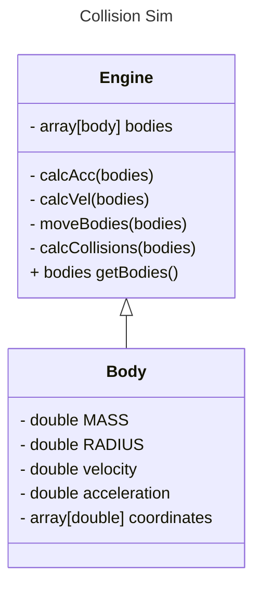

```mermaid
---
title: Collision Sim
---
classDiagram
		class Engine {
			- array[body] bodies
			- calcAcc(bodies)
			- calcVel(bodies)
			- moveBodies(bodies)
			- calcCollisions(bodies)
			+ bodies getBodies()
		}

		class Body {
			- double MASS
			- double RADIUS
			- double velocity
			- double acceleration
			- array[double] coordinates
		}

		Engine <|-- Body
```
